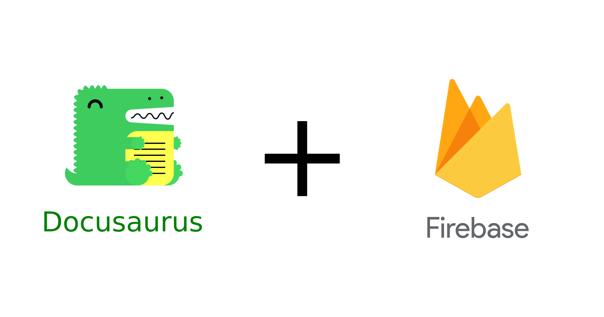

# Introduction



- [Introduction](#introduction)
  - [Branch Setup](#branch-setup)
  - [How to use](#how-to-use)
    - [Installation](#installation)
    - [Local Development](#local-development)
    - [Deployment](#deployment)

## Branch Setup

## How to Use

### Installation

```bash
npm install
```

### Local Development

```bash
npm start
```

This command starts a local development server and opens up a browser window.
Most changes are reflected live without having to restart the server.

### Deployment

To build the static files of your website for production, run:

```bash
npm build
```

This command generates static content into the `build` directory and can be
served using any static contents hosting service.

You can deploy your site to static site hosting services such as
[Vercel](https://vercel.com/), [GitHub Pages](https://pages.github.com/),
[Netlify](https://www.netlify.com/),
[Render](https://render.com/docs/static-sites),
[Surge](https://surge.sh/help/getting-started-with-surge)...

> You may check on the main Docusaurus website for further information on how to
> deploy your website, [here](https://docusaurus.io/docs/deployment).
